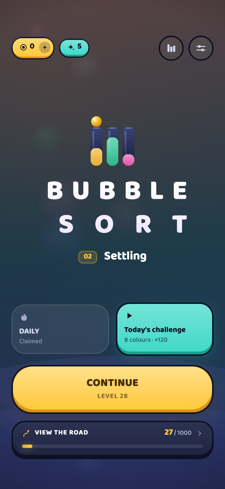
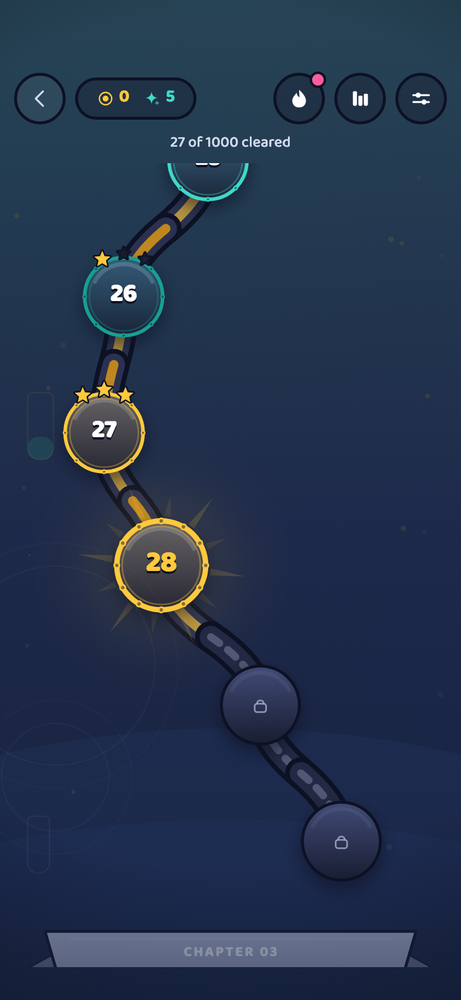
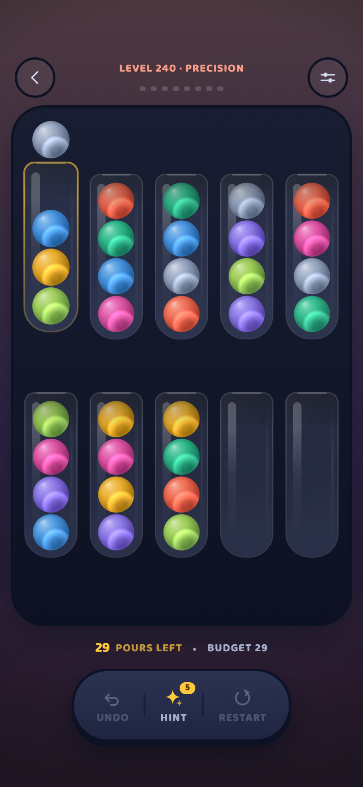
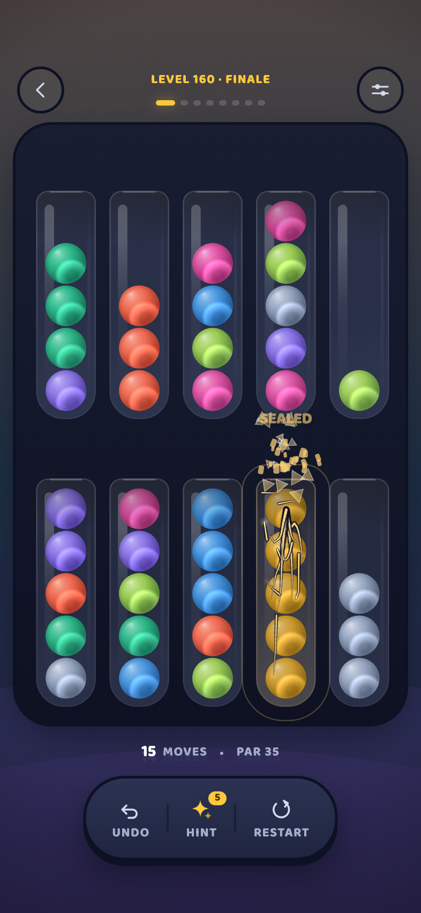
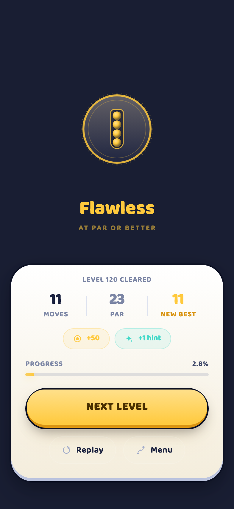

# Bubble Sort

A premium colour-sorting puzzle for Android, built in Flutter.

**1000 levels across 25 chapters.** Pour balls between glass vessels until each
one holds a single colour. Familiar mechanic; the product identity — name, mark, palette, typography, vessel and
ball rendering, motion language, icon set and sound — is original to this
project and references no existing game.

The design system, screen layouts, motion principles and level design are
documented in **[DESIGN.md](DESIGN.md)**.

---

## Screenshots

<p align="center">
  
  
  
</p>
<p align="center">
  
  
</p>

<p align="center">
  <em>Home&nbsp;· the level road&nbsp;· a lifted stack&nbsp;· a vessel sealing&nbsp;· the clear sheet</em>
</p>

These are **rendered from the app's own screens**, not photographed off a
device — see [`test/screenshots_test.dart`](test/screenshots_test.dart). A
screenshot taken by hand is a picture of one moment in one build and starts
lying the day after it is committed, because nobody ever remembers to retake
it. Rendering them means a stale screenshot is a failing test rather than
something a reader notices before the author does:

```bash
flutter test test/screenshots_test.dart                     # guard
flutter test --update-goldens test/screenshots_test.dart    # regenerate
```

---

## Colour

The ground is dark, and deliberately low in chroma.

Three palettes came before this one. Near-black with a single gold accent was
genuinely sophisticated and read as cold — a finance app that happened to
contain a puzzle. Bright violet spent the entire contrast budget on scenery,
leaving nothing for twelve saturated ball hues. Dark saturated violet was the
compromise, and it had a problem the other two did not: short wavelengths focus
at a different depth from the rest of the spectrum, so a large field of
saturated deep blue-violet gives the eye a focus it never quite settles on.
That ground was hue 256 at 75% saturation across the whole screen, in a game
people play in the dark before sleeping.

So the base gave up its chroma and kept its darkness — hue 230 at 53%. The
colour is not gone; it moved to the per-chapter [`Atmosphere`](lib/design/tokens.dart)
washes, which are broad and soft and make no demand on focus, and to the gold,
which is small, warm and the only thing on screen asking to be pressed.

The important part is that **every ground value is matched to the luminance of
the colour it replaced, to within 1%**. That was not the first attempt.
Dropping saturation while keeping the same hex lightness produced a ground a
third brighter than the old one, which quietly cost almost every ball 10% of
its contrast — a palette easier to look at and harder to play on. Held at equal
luminance the change is free:

| ball vs. ground | before | after |
|---|---|---|
| nine unchanged hues | — | identical |
| Slate | 4.81 | **6.73** |
| Cobalt | 2.96 | **3.55** |
| Plum | 2.15 | **2.96** |
| gold (the action colour) | 11.17 | 11.16 |

Slate, Cobalt and Plum were lifted because they are the three hues nearest the
ground's own family; Plum was the darkest ball in the set and was disappearing
into it.

## Running it

The Flutter SDK lives at `~/development/flutter` on this machine.

```bash
export PATH="$HOME/development/flutter/bin:$PATH"

flutter pub get
flutter run                       # attached device or emulator
flutter build apk --release       # or: flutter build appbundle
```

Portrait only, Android and iOS. No accounts and no analytics. Progress, coins
and the daily streak all live in local storage; the only network traffic the
app makes is a rewarded-video request, and only when a player taps a button
asking for one.

---

## Layout

```
lib/
  main.dart                  entry point, system chrome, orientation lock
  app.dart                   root WidgetsApp, service boot, brand splash

  design/
    tokens.dart              colour, spacing, radius, shadow, duration, easing
    typography.dart          the two bundled variable faces and every text style

  data/
    level.dart               plain level model — no Flutter, no colours
    levels.dart              GENERATED level catalogue (see tools/)

  engine/
    board_state.dart         the rules, and nothing else. Immutable, testable
    game_controller.dart     orchestrates one playthrough: timing, feedback
    solver.dart              greedy best-first search behind the hint button

  services/
    settings_service.dart    sound / music / haptics / colour assist
    progress_service.dart    best scores, unlocks, hints, tutorial flag
    audio_service.dart       pre-sourced player per cue, plus the ambient loop
    haptic_service.dart      a small vocabulary of touch responses

  ui/
    app_scope.dart           the four services, handed down the tree
    transitions.dart         screen and sheet routes, staggered entrances
    screens/                 home, game, the level road, settings, level complete
    widgets/                 board, vessel, ball, shatter, buttons, icons, background…

tools/
  gen_levels.js              level generator + exhaustive BFS solver
  gen_audio.py               procedural sound design

assets/
  fonts/                     Baloo 2 (variable) + its OFL licence
  audio/                     24 CC0 cues + four synthesised music stems
  levels/levels.json         1000 generated levels (~103 KB)
```

The dependency direction is one-way: `engine` knows nothing about `ui`, and
`data` knows nothing about either. `board_state.dart` and `solver.dart` have no
Flutter import at all, which is what lets the solver run in a background
isolate and the rules be tested headlessly.

---

## Content pipeline

Levels and sounds are **generated and verified**, not hand-authored.

### Levels

```bash
node tools/gen_levels.js            # ~30s, writes assets/levels/levels.json
node tools/gen_levels.js --levels 200 --out /tmp/sample.json
```

1000 levels across 25 chapters. Candidates are produced by reverse-scrambling
from the solved state, then **every one is put through a solver before it is
allowed into the catalogue** - scrambling is not a proof of solvability, because
the game moves whole runs and forbids parking a pure stack in an empty vessel,
so a scrambled board can be unreachable backwards through legal pours. About
5900 candidates were discarded on those grounds.

`par` is always a real solution length that was found, never an estimate: exact
via A* where the search is tractable (978 of 1000), best-of-beam-search
otherwise. `Level.parIsOptimal` records which.

Changing the catalogue means editing the `CHAPTERS` table and re-running. No
game or UI code changes - levels are content, and they ship as an asset rather
than as generated Dart.

### Audio

```bash
python3 tools/gen_audio.py
```

Twenty cues plus a 25.6-second ambient loop, all synthesised from scratch.
Everything pitched is a two-operator FM bell or a plucked string rather than a
sine with an envelope on it, everything passes through a Schroeder plate
reverb, and the master is soft-clipped before it is normalised — a dry cue
sounds like it is coming out of the phone, a cue with a tail sounds like it is
happening somewhere.

Two details carry most of the character:

- **Completion cues walk up a D major pentatonic**, and their sparkle layer
  gets brighter with each one, so clearing a board is an audibly escalating
  phrase rather than the same reward eight times. The glass crackle the player
  *sees* is a layer of the cue they *hear*, so the fracture is one event.
- **`drop_1`–`drop_4`** step up the scale, one per ball in a run, so a
  four-ball pour lands as a four-note figure instead of the same plop four
  times.

The loop's filter LFO, tremolo and arpeggio all complete a whole number of
cycles inside its length, which is what lets it repeat without a seam.

---

## Three kinds of level

Ball-sort's weakness as a genre is that every level is the same verb. Three
things a level can be, besides ordinary:

**Hidden balls.** From chapter 4, roughly every third level conceals
everything below the top ball in a few vessels — drawn as unlit glass with a
`?`, in no colour at all. Pouring the top off reveals the next. The rules and
the solver always see the true contents; only the player is in the dark. Undo
does not re-hide.

**Precision.** Every fifth level from chapter 2 has a hard pour budget of par
plus two, charged against every pour ever made — undo still works but no
longer refunds. Run out and the board fails.

**Finales.** The last level of each chapter carries one more colour than the
rest of it, is generated to out-par everything before it, pays double, has its
own cue, and drops a cosmetic on first clear.

## Obstacles

Two, staggered so each is introduced alone in its own chapter and they only
combine from chapter 11. 18% of levels carry one.

**Narrow neck** (chapter 6+) — a brass collar. The vessel pours *one ball at
a time* instead of the whole matching run. It forbids nothing; it makes the
move the player has stopped thinking about cost three times as much, which is
the biggest strategic change available in this genre.

**Colour lock** (chapter 9+) — a tinted rim. The vessel accepts one hue,
ever. Forces destinations to be planned from the first move.

Both are *pure functions of the board*, and that is not an accident. The
solver dedups on a board key, so an obstacle that depended on history — "this
vessel cracks after three pours" — would mean two identical-looking boards
were no longer the same search node. Dedup breaks, the search space explodes,
and the guarantee that every one of the thousand levels is solvable goes with
it. That guarantee is worth more than any single obstacle.

Vessel traits are folded into the key *before* its sort, so two boards
differing only by which vessel holds a stack still collapse to one node —
unless the vessels behave differently, in which case they emphatically do not.

Alongside those, **flow**: consecutive seals without an undo climb a coin
multiplier to ×2, shown live on the board.

## Feedback

Sound and haptics are a **vocabulary**, not a set of call sites.

They used to be attached wherever someone remembered: an audit found
`buttons.dart` carrying twenty-eight tap handlers and zero cues, which is
exactly why play-testing reported that the same control made a noise on one
screen and none on the next.

Now the *components* fire their own, through
[`Fx`](lib/ui/feedback.dart). Every entry point pairs a sound with a
vibration — a cue with no haptic is inaudible on a muted phone, a haptic with
no cue is invisible on a loud one:

| | Sound | Haptic |
|---|---|---|
| `Fx.press` | fat, low pop | medium impact |
| `Fx.tap` | bright pop | selection click |
| `Fx.toggle` | rising / falling pair | selection click |
| `Fx.navigate` | whoosh | selection click |
| `Fx.refuse` | damped thud | light impact |
| `Fx.reward` | sparkle ping | medium impact |
| `Fx.unlock` | rising sweep + ding | heavy impact |

[`feedback_test.dart`](test/feedback_test.dart) enforces it against the
source: components must fire their own feedback, screens must not play raw
interface cues, and every `Fx` method must do both halves. It is a rule about
where code lives, and no runtime assertion can catch it being broken.

The cues themselves are no longer synthesised. They are CC0 samples from
[Kenney](https://kenney.nl) — Interface Sounds, Impact Sounds and Music
Jingles — assembled by
[`tools/build_audio.py`](tools/build_audio.py). Creative Commons Zero: free
for commercial use with no attribution required, and the licence ships in
`assets/audio/`.

Three passes of procedural synthesis, and three rounds of "the sounds are
still bad", made the verdict clear: a Python script making oscillators cannot
compete with recorded and designed samples. Two details in the build:

- **Balls landing use actual glass impacts**, which is what is happening on
  screen.
- **The eight seal cues are one struck bell**, resampled up a scale. Because
  it is literally the same hit, the set is coherent in a way eight separately
  chosen samples never would be — and because resampling moves pitch and
  length together, a higher one is also a shorter one, exactly as a smaller
  struck object behaves.

The packs ship Ogg Vorbis, which Android plays and iOS does not, so the build
converts everything to 16-bit PCM using macOS's own `afconvert`.

## The score

**Off by default.** The effects are real samples now; the music is still
synthesised and sounds it, and silence is better than a loop the player wants
to escape. The stems are interchangeable — any four loops of equal length and
tempo drop straight in, which is the one piece of audio worth paying a
composer for.

Not one loop but four — pad, bass, drums, melody — at 96 BPM over eight bars,
and the board decides how many are audible. Pad alone on the menu; each
vessel sealed brings in another layer, so by the last seal the full track is
playing. Music is feedback for progress, not wallpaper behind it. Kick and
hats share one file so they cannot drift against each other.

## The reward loop

Five systems, all local except the last:

**Cosmetics.** Six ball looks and four vessel skins — each a different
lighting model, never a recolour, so the puzzle reads the same whatever is
equipped. Three are bought with coins; four are earned by finishing a chapter
and cannot be bought, which is what makes them worth having. This is what the
economy was missing: nobody wants a hint, but everyone wants the marble set
they can't afford yet.

**The daily challenge.** One level per calendar day, the same for everyone,
hashed from the day so it agrees on every device forever. Pays 120 coins
once, never advances the road.


**Coins.** Every clear pays out, scaled by grade and by flow — 50 for a flawless line, 30
for a good one, 15 otherwise. A *replay* pays 5 whatever the grade, which is
the important number: paying nothing makes replaying a solved board feel
pointless, and paying full rate turns level 1 into an ATM the moment a player
notices.

**The daily streak.** A seven-rung ladder that escalates across the week and
returns to the foot of it on the eighth day, so there is always a visible next
rung. Claiming is a date written to disk — days since the epoch in *local*
time, deliberately not UTC, or a player west of Greenwich loses a streak they
turned up for. Missing a day reads as broken immediately rather than showing a
stale number until the next claim silently resets it.

**Rewarded video, and only rewarded video.** There is no banner and no
interstitial. Every ad is one the player asked for by tapping a button that
says what they get, nothing interrupts a board, and nothing plays between
levels. That costs several times the revenue of an interstitial after each
clear and buys the unhurried feel the rest of the game is built on.

The shop sells hints and nothing else — never progress. See
[`wallet_service.dart`](lib/services/wallet_service.dart) and
[`ads_service.dart`](lib/services/ads_service.dart).

> **Before release** the AdMob ids are Google's public test ids and earn
> nothing. Three places need your own: the rewarded unit ids in
> `lib/services/ads_service.dart`, plus the application ids in
> `android/app/src/main/AndroidManifest.xml` and `ios/Runner/Info.plist`. The
> SDK reads those two at process start, so a missing or malformed value is a
> crash on launch rather than a failure to show an ad. Shipping ads also
> requires a privacy policy URL, Play Data Safety answers, and an iOS App
> Tracking Transparency prompt.

---

## Tests

```bash
flutter test                              # everything
flutter test test/engine_test.dart        # rules + level catalogue
flutter test --update-goldens             # re-render the screen goldens
```

**`engine_test.dart`** covers the pour rules, undo as an exact inverse, and
dead-end detection - plus the whole 1000-level catalogue: chapters tile the
range contiguously, every hue appears exactly `capacity` times, no level asks
for a hue the palette does not have, difficulty rises inside every chapter, no
par falls below the board's own provable floor, the opening levels stay gentle,
the runtime solver finds a legal line on a sample spanning all 25 chapters, and
following it move-by-move actually solves level 1000.

**`screenshots_test.dart`** renders the five images at the top of this file out
of the real screens, driving them through real taps — the shatter shot walks
the solver's line until a vessel seals and stops inside the celebration. It
doubles as coverage: it is what caught the board pushing a lifted stack off the
top of the screen on height-bound boards.

**`wallet_test.dart`** covers the economy, and most of it is the streak —
the only part of the game whose behaviour depends on the calendar, and so the
only part whose bugs are invisible in testing and infuriating a day later. It
checks that a missed day breaks the streak, that a second claim on one day pays
nothing, that the seventh-day prize is actually reachable by claiming seven
days running, and that a streak survives crossing a month boundary.

**`controller_test.dart`** covers pacing rather than rules: that a tap arriving
mid-flight is queued instead of dropped, that two chained pours leave no idle
frame between them, that the queue is one deep, that undo and restart discard
it, and that the seal counter advances only on seals. None of this is visible
to the rules tests — the board was always *correct* while it was dropping
every tap that landed inside a pour.

**`navigation_test.dart`** drives the real `BubbleSortApp` the way a player does —
boot, PLAY, the level road, the settings sheet, a pour and an undo. The golden
tests each wrap a screen in their own `AppScope`, so they cannot see whether the
*app* provides one where it is needed. It did not, and this is the test that
would have caught it.

**`golden_test.dart`** renders every screen to a PNG under `test/goldens/`.
These exist to be *looked at*: whether spacing, weight and light read as premium
is only answerable by looking at a frame. Two harness details matter —

- the test surface is resized to a real handset, or every golden renders into
  the framework's 800×600 default, which is a landscape tablet;
- `debugDisableShadows` is turned off around each render, or every soft glow in
  the design is drawn as a hard, unblurred bevel.

---

## Scope

Deliberately absent, per the product brief: ads, in-app purchases, login,
multiplayer, leaderboards, cloud saves, rating prompts, notifications. Progress
and settings are stored locally via `shared_preferences` and nothing leaves the
device.
